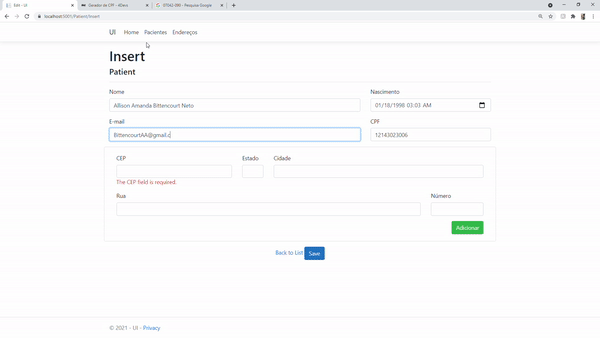

# MVC-ADO.NET-exp
This is an ADO.net CRUD example made using asp.net 5.0, we will consume some API's to auto-fill address information and to send e-mail confirmations.

Here's an example how its look like adding a new Patient with auto-fill: 

